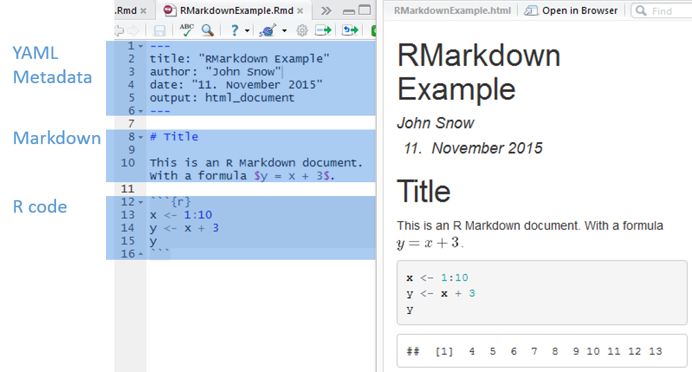
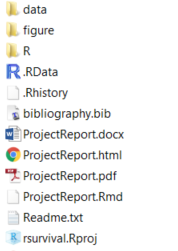

# rr-r-publication
Reproducible Research Workshop Demo repository for publication writing in R

# Tutorial 2: Writing publications with R (Work in progress!)

This tutorial in the context of the **Reproducible Research Workshop** provides you with the first steps on how to write publications in R.

**Objectives of this tutorial:**

* Installation and setup of R, RStudio and Miktex
* Load a template project to RStudio (or Fork it from GitHub, see part 4 of the previous tutorial)
* Generate an example report as an HTML, Word or Latex document
* Generate a sample publication
* Prepare a publication for use in Overleaf

## Motivation

Wouldn't it be great to combine analysis, data, results, plots, bibliography and text all together and generate and later on regenerate a report or publication with the click of one button?

Some reasons to create a reproducible report with R (and Markdown) are:

* It makes changing and updating your publications easier
* You can easily change the output format from PDF (via Latex), Word and HTML
* You can keep all relevant parts of your project together
* **TODO** add more reasons

## Publication generation workflow in R

R with the help of some tools mainly knitr and behind the scenes Pandoc enables you to automatically generate reports in various formats (HTML, PDF and Word) from your analysis.

The key elements in this process are: 

* **[RMarkdown](http://rmarkdown.rstudio.com):** Convenient to produce reproducible documents. It allows to combine your text content and code in one single file. Simply put it's markdown text with distinct are code blocks. Good for version control.
* **Markdown: TODO Add link** Simple markup language, fast to write and easy to read, lacks fancy formating options (but are they really needed?)
* **[knitr](http://yihui.name/knitr):** R package for dynamic report generation in R 
* **[Pandoc](http://johnmacfarlane.net/pandoc):** Universal document converter, pandoc is your swiss army-knife to render documents from one markup language into another.

In **RMarkdown** the text is written in _markdown_ and the _R code_ is put in distinct _code blocks_ (or code chunks). The text and R chunks together are then rendered with the knitr package to a document.

The workflow to create such a document with R is:

1. Create an .Rmd file (Markdown with R code blocks, called "code chunks")
2. Write your report and include your data, code, analysis and text
3. Use the knitr package to combine text and the R scripts and render a markdown file from the RMarkdown
4. Convert the files with Pandoc to generate html (can be self-contained), doc, Word documents

In RStudio the **knit button** combines steps 3+4 behind the scene to compile the documents from the RMarkdown file.


## Part 1: Installation & Setup

**1. Installation:** To get started you need the following software installed on your computer: If you are new to R, then you need to install [R](https://www.r-project.org) and [RStudio](https://www.rstudio.com). Furtermore to generate PDF files you'll need a running Latex environment such as [Miktex](http://miktex.org). 

Ideally you also have Git ([Download Git](https://git-scm.com/downloads)) installed and setup. To get an idea on how to use Git follow the tutorial _"How to use Git with R and RStudio"_.

1. **R ([Download R](https://cloud.r-project.org)):** Download and install R (if not already installed).
2. **RStudio ([Download RStudio Desktop](https://www.rstudio.com/products/RStudio/#Desktop)):**  Download and Install RStudio (if not already installed) 
3. **Miktex ([Download Miktex](http://miktex.org))**: Download and install Miktex, if you want to generate PDF documents. To generate PDFs Pandoc requires an working Latex environment. 
4. (Git Tutorial) **Git ([Download Git](https://git-scm.com/downloads)):** Download and Install Git. 
   _Optional Git clients: [SourceTree](https://www.sourcetreeapp.com) or [GitHub Desktop](https://desktop.github.com)_.
5. (Git Tutorial) **GitHub account**: On [GitHub](https://github.com/) create yourself a free GitHub account. _If you are new to Git follow the 15 min [TryGit Tutorial](https://try.github.io) to get a quick introduction to Git._ 

**2. Setup up Latex/Miktex in RStudio**:

**TODO** check which settings or tutorials to use

## Part 2: Generate a simple RMarkdown file

RMarkown file consists of a **YAML Metadata** block, **Markdown** text elements and **R Code chunks** illustrated in the next figure.



**YAML Metadata:** blocks serves to include some metadata about the RMarkdown document, such as who is the author of the document or should it be rendered into a HTML, PDF or a word document. A YAML block is on the top of the page and delimited with `---`.

The plain text elements are structured with the **Markdown** syntax. In RStudio got to _Help > Markdown Quick Reference_ to open the Markdown syntax reference.

The **R code chunks** are where you can add your R code and start with ` ```{r *} ` on a new line and end with ` ``` `.


**1. Create an new RMarkdown document**: In RStudio go to _File > New File > RMarkdown..._


In the menu provide a _title_, an _author_ and keep the default output format as _HTML_. RSTudio opens the following example document to provide a fast dive into RMarkdown.

**2. Generate the HTML document**: Rather _knit_ the document. On top of the RMarkdown document press the _knit HTML_ button. Depending on the settings in the YAML metadata it should be set to HTML.


**3.  Edit the RMarkdown file **: 

- edit markdown
- edit code (make it visible)
- edit yaml 


## RMarkdown + RStudio 


RStudio:    
Simply go to **File -> New File -> R Markdown...**    
and select in the opening interface **"Document"**.

Note: For PDF generation you need an installed latex environment (e.g. [Miktex ](http://miktex.org/))


## RMarkdown 


## Create and structure an R project 

---------------------- ---------------------------------------------------------------
**Folder structure:**  What structure might be useful?
**Data organisation:** How do you organise your (raw/derived) data? 
**Documentation:**     What do you document? Will you be reusing the data? Difficult parts, will you remember how you did it?
**Scope:**             What's the scope of the project?
**Report:**            Report structure
**Reusability:**       Which functionalities will you reuse?
**Extendable:**        What if the project becomes larger?
---------------------- ---------------------------------------------------------------

## Example folder structure 

--------------------- -----------------------------------------
**R**                 R folder storing all the *.r* code files
**data**              Data folder with the raw and the derived data (e.g. data.csv, data.RData)
**figures**           Figure folder (e.g. pictures, logo etc.)
*myproject.RProj*     RStudio project file
*ProjectReport.Rmd*   RMarkdown storing the report text and R analysis code
*ProjectReport.pdf*   Generated report from the RMarkdown file
*Readme.txt*          Information about the project. *(good practice)*
--------------------- -----------------------------------------

    
This project folder:     


## Workflow 

Structure your project into the following steps:

1. Data collection 
2. Preprocessing
3. Analysis
4. Presentation 

## Practical tips


1. Create an RStudio project for every project in a separate folder 
2. Document everything, your documents should be understandable by someone other than you
3. Plan your project, organise and store your data, code and reports
4. Start small, with a subset of your data
5. Link your workflow (e.g. data files as an input to your analysis files)


## Cheatsheets

- [RMarkdown](http://shiny.rstudio.com/articles/rm-cheatsheet.html) https://www.rstudio.com/wp-content/uploads/2015/02/rmarkdown-cheatsheet.pdf
- [RMarkdown 2](http://www.utstat.toronto.edu/reid/sta2201s/rmarkdown-reference.pdf)


