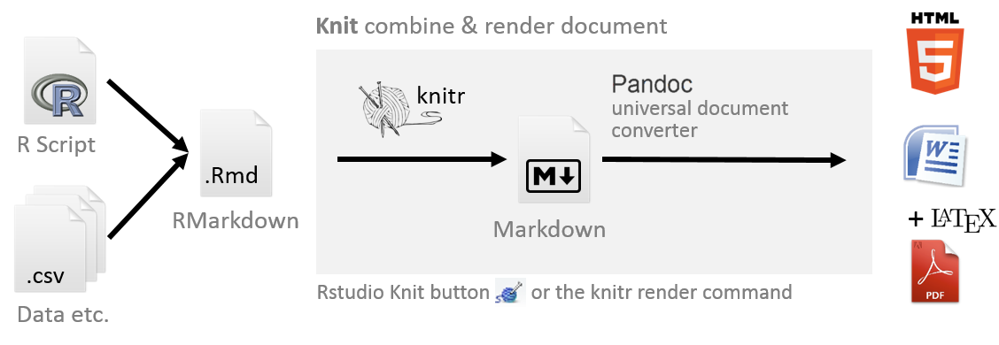
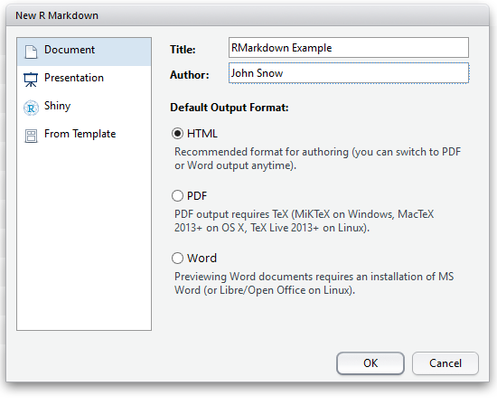
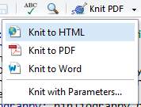

# RR Workshop Tutorial: Writing publications with R

This tutorial in the context of the **Reproducible Research Workshop** provides you with the first steps on how to write publications in R.

**Objectives of this tutorial:**

* Installation and setup of R, RStudio and Miktex
* Load a template project to RStudio (or fork it from GitHub, see part 4 of the previous tutorial)
* Generate an example report as an HTML, Word or Latex document
* Generate a sample publication
* Prepare a publication for use in Overleaf

## Motivation

Wouldn't it be great to combine analysis, data, results, plots, bibliography and text all together and later on regenerate a report or publication with the click of one button?

Some reasons to create a reproducible report with R (and Markdown) are:

* It makes changing and updating your publications easier
* You can easily change the output format from PDF (via Latex), Word and HTML
* You can keep all relevant parts of your project together


## Publication generation workflow in R

R with the help of some tools (mainly knitr and behind the scenes Pandoc) enables you to automatically generate reports in various formats (HTML, PDF and Word) from your analysis.

The key elements in this process are: 

* **[RMarkdown](http://rmarkdown.rstudio.com):** Convenient to produce reproducible documents. It allows you to combine your text content and code in one single file, making it easy to document, version, and share your analyses. It consists of markdown formatted text with R code blocks.
* **[Markdown](https://daringfireball.net/projects/markdown):** Simple markup language, fast to write and easy to read, lacks fancy formating options (but are they really needed?), so you can focus on content. A play on "markup".
* **[knitr](http://yihui.name/knitr):** R package for dynamic report generation in R 
* **[Pandoc](http://johnmacfarlane.net/pandoc):** Universal document converter, pandoc is your swiss army-knife to convert and render documents from one markup language into another. (RStudio comes with the Pandoc binaries included)

In **RMarkdown** the text is written in _markdown_ and the _R code_ is put in distinct _code blocks_ (or code chunks). The text and R chunks together are then rendered with the knitr package to a document.

The workflow to create such a document with R is:

1. Create an .Rmd file (Markdown with R code blocks, called "code chunks")
2. Write your report and include your data, code, analysis and text
3. Use the knitr package to combine text and the R scripts and render a markdown file from the RMarkdown
4. Convert the files with Pandoc to generate HTML (can be self-contained), PDF, Word documents

In RStudio the **knit button** combines steps 3+4 behind the scene to compile the documents from the RMarkdown file.



## Part 1: Installation & Setup

**1. Installation:** To get started you need the following software installed on your computer (you may have most or all of these installed already!): 

1. **R ([Download R](https://cloud.r-project.org)):** Download and install R.
2. **RStudio ([Download RStudio Desktop](https://www.rstudio.com/products/RStudio/#Desktop)):**  Download and Install RStudio
3. **Miktex ([Download Miktex](http://miktex.org/download))**: Download and install Miktex, if you want to generate PDF documents. To generate PDFs Pandoc requires a working Latex environment. 
4. (Optional) **Git ([Download Git](https://git-scm.com/downloads)):** Download and Install Git. (You can follow this tutorial without Git and GitHub.)
   _Optional Git clients: [SourceTree](https://www.sourcetreeapp.com) or [GitHub Desktop](https://desktop.github.com)_.
5. (Optional) **GitHub account**: On [GitHub](https://github.com/) create yourself a free GitHub account. _If you are new to Git follow the 15 min [TryGit Tutorial](https://try.github.io) to get a quick introduction to Git._ 

**2. Setup up Latex/Miktex in RStudio**:

With Miktex installed the generation of PDF files via Latex should run just fine. RStudio will find the Latex environment through the PATH variable.

**Note:** On windows check the PATH variables in R console with `Sys.getenv("PATH")` (If you want to set a PATH variable for one session only, you can use the following command `Sys.setenv(PATH = paste(Sys.getenv("PATH"), "C:\\YOURPATH\\MikTeX\\miktex\\bin", sep=.Platform$path.sep))`)

**3. Install the knitr package:** Type the following in the R console `install.packages("knit")` and hit enter to install this package. 

## Part 2: Download the GitHub repository with the tutorial project

The following GitHub repository https://github.com/314a/rr-r-publication contains the example files used in this tutorial. You can either download the repository (.zip file) or clone the project as a new R Project.

a) **Download .zip** file https://github.com/314a/rr-rstudio-git/archive/master.zip. Unzip the file in your R Workspace folder, where you store all your different R projects. Rename the _master_ folder to _rr-r-publication_. Within this folder open the _rr-r-publication.RProj_ file to open this RStudio project.  
b) **Clone the repository**: If you have Git installed, go to _File > New Project..._ and create a new project from _Version Control_ and enter the following repository url: `https://github.com/314a/rr-r-publication.git`. RStudio then clones the repository into the R workspace folder you provided.

Now open the RStudio project by opening the project file `rr-r-publication.Rproj`.

## Part 3: Generate a simple RMarkdown file

An RMarkown file is a text file that contains three types of content: **Markdown** text to for example describe your analysis or data, **R Code chunks** to run code, and **YAML metadata** which guides some of the build process.

* The **YAML metadata** block at the top of the file serves to include some metadata about the RMarkdown document, such as who is the author of the document, and whether it should be rendered into an HTML, PDF, or Word document. A YAML block is at the top of the page and delimited with `---`.
* The **R code chunks** are where you can add your R code and start with ` ```{r} ` on a new line and end with ` ``` ` on a new line. **Important:** this is a "back tick" and not an "apostrophe" character.
* The rest of the document is a plain text document with the **Markdown** syntax. In RStudio, go to _Help > Markdown Quick Reference_ to open the Markdown syntax reference. 

The following minimal RMarkdown example contains all three RMarkdown parts, a YAML header in the beginning, text with the Markdown syntax, and R code chunks.

**RMarkdown minimal example:**

    ---
    title: "RMarkdown Minimal Example"
    author: "Pie Bear"
    date: "19 August 2016"
    output: html_document
    ---
    
    ## Markdown 
    
    This is an **RMarkdown** document. You can write text in **bold** or _cursive_, include [links](http://geo.uzh.ch) or add inline formulae $y=x+3$ (following Latex formulae markup)
    
    ## Markdown with R code
    
    ```{r}
    d  <- data.frame(participants=1:10,height=rnorm(10,sd=30,mean=170)) 
    summary(d)
    ```
    you can include R elements inline and generate plots:
    
    ```{r chunk_name}
    plot(d)
    ```
    
    There were `r nrow(d)` participants.

**1. Create a new RMarkdown document**: In RStudio go to _File > New File > RMarkdown..._. In the menu keep the default output format as _HTML_ and press OK. RStudio opens an example RMarkdown document so you can quickly get started. Copy the content of the above **RMarkdown minimal example**, replacing all the default content from RStudio.



**2. Generate the HTML document**: Rather _knit_ the document. First save the RMarkdown file as _publication_minimal.Rmd_ in your R working directory. On top of the RMarkdown document press the _knit HTML_ button. Depending on the settings in the YAML metadata it should be set to HTML. After some seconds the created HTML document will open in a separate window in RStudio.




## Part 4: Edit a simple RMarkdown file

**1.  Edit Markdown elements**: Now let's edit the RMarkdown file. Include the following snippet with new Markdown elements -- a list, a table and an image -- below the first paragraph (Line 10) of your document and knit the document again. 

    **List:**
    
    1. ordered list element
    2. make it an unordered list 
    3. replace the numbers with `*`  
    
    **Table:** 
    
    Name          | Value
    --------------| ------------------
    Reproducible  | is coool
    Research      | and fun!
    
    : This is a table caption
    
    **Image:**
    
    
    
**2. Edit R code chunks:** R chunks are evaluated in the order that they appear in the document. It is good practice to give each code chunk a meaningful name. The name of the chunk in our file is currently `chunk_name`. Let's rename the first code chunk to `{r simulate_data}` and the second to `{r scatterplot}`.

R code chunks will print the R code and the output of that code chunk. _Chunk options_ allows you to control a few things like whether to print the R code in the output. If no R code should be printed, then set the `echo = FALSE` option, or if the figure size should overwrite the default size, set `fig.width=4,fig.height=2`.

    ```{r simulate_data, echo=FALSE}
    d  <- data.frame(participants=1:10,height=rnorm(10,sd=30,mean=170)) 
    summary(d)
    ```
    you can include R elements inline and generate plots:
    
    ```{r scatterplot, echo=FALSE, fig.width=4,fig.height=2}
    plot(d)
    ```
    
**Advanced:** You can also set these options globally with `opts_chunk$set` in the beginning of the RMarkown file. I often use the following code chunk in the beginning of each RMarkdown document (after the YAML metadata block).

    ```{r setup, comment=FALSE, message = FALSE, echo=FALSE, warning=FALSE}
    rm(list=ls())           # Clean the environment
    options(scipen=6)       # display digits proberly!! not the scientific version
    options(digits.secs=6)  # use milliseconds in Date/Time data types
    options(warning=FALSE)  # don't show warnings
    library(knitr)          # set global knitr options of the document
    # Here we set the R code invisible to not show when the document is rendered
    opts_chunk$set(comment="", message = FALSE, echo=FALSE, error=FALSE, warning=FALSE)
    ```

**3. Edit the YAML metadata:** The YAML metadata lets you control a few things about how to render the output document. Change the author name from _Pie Bear_ to your own name (or your favorite alias!). Now we want the document to display today's date. It is possible to include inline R expressions such as ``` `r Sys.Date()` ``` in the YAML metadata. So let's replace `date: "19 August 2016"` with ```date: "`r Sys.Date()`" ```. 

The _output_ argument allows to specify the output document and various options. To render a _Word document_ instead of an _HTML document_ we replace the output `output: html_document` with `output: word_document`. In RStudio you can specify some of the _output options_, you find this menu -- a cogwheel -- to the right of the knit button. By changing them you'll see that the YAML metadata changes accordingly in the RMarkdown document. Type `?html_document` or `?word_document` in the R console to find more information on the available metadata arguments or consult the online documentation for [HTML Documents](http://rmarkdown.rstudio.com/html_document_format.html) and [Word Documents](http://rmarkdown.rstudio.com/word_document_format.html).

    ---
    title: "RMarkdown Minimal Example"
    author: "Your Name"
    date: "`r Sys.Date()`"
    output: word_document
    ---
    
**Advanced:** The different output formats let you also specify various style options, such as .css stylesheets for HTML, or a template document for Word. The following YAML metadata includes the _reference_docx_ which points to a template Word _docx_ file. The rendered output Word document will then include the Word styles defined in the reference template.docx. If you want to test use the header below in your R Markdown. The project folder includes a `template.docx` file to play around with.

    ---
    title: "RMarkdown Minimal Example"
    author: "Your Name"
    date: "`r Sys.Date()`"
    output: 
      word_document:
        fig_caption: yes
        reference_docx: template.docx
    ---

**4. Include references and citation styles:** In order to include citations, you can specify a bibliography file in the YAML metadata. A widely used format is the _.bib_ format. Most literature/reference management software ([Mendeley](https://www.mendeley.com), [Zotero](https://www.zotero.org) etc.) provide export functionalities to save references as .bib files of the whole library or of a selected list for a publication. The current project already includes a `bibliography.bib` and in addition a CSL 1.0 style file, so you are fine to continue with the next steps. 

1. Specify the .bib file on a new line in the YAML metadata block `bibliography: bibliography.bib`. 
2. Include some references in the markdown text blocks. Each citation starts with a '@' followed by a _citation key_ e.g. `@Brunsdon2015`. Enclose them in square brackets `[@Brunsdon2015]` or use a semicolon to specify more authors `[@Brunsdon2015;@Nature2016]`. For instance include `@Brunsdon2015 says ...` or `[@Brunsdon2015;@Nature2016]`.
3. Citations are included after the last paragraph in the R Markdown document. So include on the last line of your document an appropriate header in markdown text, like `# References`.
4. To change the citation style, which by default is set to Chicago author-date format, you need to specify a _CSL 1.0_ file in the _csl_ metadata field. Add on a new line in the YAML metadata block the following `csl: taylor-and-francis-harvard-x.csl`.
4. Render the document to see how the references are included.

Your YAML header now may look like this:

    ---
    title: "RMarkdown Minimal Example"
    author: "Your Name"
    date: "`r Sys.Date()`"
    output: word_document
    bibliography: bibliography.bib
    csl: taylor-and-francis-harvard-x.csl
    ---

More about citations and references: 

* R Markdown documentation on [bibliographies and citations](http://rmarkdown.rstudio.com/authoring_bibliographies_and_citations.html)
* Find and download different .csl styles at https://www.zotero.org/styles (you may also need some .csl style files for Mendeley etc.). The style file used in this tutorial is here: [Example Tailor and Francis Harvard X](https://www.zotero.org/styles/taylor-and-francis-harvard-x)
* The [CSL style editor](http://editor.citationstyles.org) allows you to interactively edit the .csl style files, if your style file doesn't exactly comply with the one requested from the journal or conference editors. Finding the name of a requested style often involves a bit of guess work.

**Note:** RStudio as of now provides a spell checker you can invoke manually with the key `F7`, but it does not provide an as-you-type spell checker.

## Part 5: Explore a more complex report/publication 

Generating a report in RMarkdown is relatively simple, as you've seen above. However, getting things just right for a more complex RMarkdown file can sometimes be a bit more work - remember usually spending more time getting things right at this stage will save you a lot of time down the line!

We've prepared a report `publication.Rmd` based on some preliminary data from a study examining attitudes about a new Swiss national park. We will not modify this document in this tutorial, but instead examine it as it presents working examples of making analysis, figures and tables reproducible. This project you downloaded from GitHub is furthermore an example of how you can structure an R project.

**1. Project structure**: By looking at the project structure, think of how you might want to structure a project and consider the following aspects:

* **Folder structure:** What structure might be useful?
* **Data organisation:** How do you organise your (raw/derived) data? 
* **Documentation:** What do you document? Will you be reusing the data? Difficult parts, will you remember how you did them?
* **Scope:** What's the scope of the project?
* **Report:** Report structure
* **Reusability:** Which functionalities will you reuse?
* **Extendability:** What if the project becomes larger?

**2. Example folder structure:** It's helpful to keep your files tidy and to adhere to a certain structure across your projects. The longer you work with R the more you'll have a set way to organise your project files and folders. For instance in this project we have:

* **R**: R folder storing all the *.r* code files
* **data**: Data folder with the raw and the derived data (e.g. data.csv, data.RData)
* **figures**: Figure folder (e.g. pictures, logo etc.)
* *rr-r-publication.RProj*: RStudio project file 
* *publication.Rmd*: RMarkdown storing the report text and R analysis code
* *publication.pdf*: Generated report from the RMarkdown file
* *publication.tex*: Generated .tex from the RMarkdown file, which you can use in your Latex environment or for instance [overleaf](https://www.overleaf.com).
* *README.md*: Information about the project. *(good practice)*

**3. Explore the publication.Rmd example:** Open the document at `publication.Rmd`. This document should illustrate how publications in R with R Markdown can be written, with the help or some packages. It's based on a concrete research use case, and exemplifies some of the caveats and implications that may occur when writing a reproducible document and publishing it online on a Git repository. It also presents typical use cases in Markdown usage and presents some tricks. 

Examine the Markdown used to generate references, lists and figures. Look at the different R chunks and how particular settings are handled at the beginning of the document. 

**4. Render the publication.Rmd document** and feel free to play around with this file and see how the document changes.

**Some notes on reproducibility**: (you'll find them also in the document)

* Depending on the data to analyze, privacy may play a role. While for the analysis itself the data is being anonymised, storing the raw or preprocessed data on a public repository may pose privacy issues or even constitute a violation of contract.
* Web APIs are subject to license restrictions, can get altered by the service provider, or can simply cease to exist, so consider them carefully before using them in a scientific project. Consider instead using software which you can store locally and can better control the parameters and settings. If collecting data from an API, ensure to note down as much as possible about the data collection: the date range, all the query parameters, including the service limits at the time, any interruptions in service, and so on. It's also wise to back up the data thus obtained, if at all possible!
* Due to license restrictions of the open geodata, it is not possible to store the data on a public Git repository. The included script `R/loadMapData.r` downloads the data directly from the link provided in the geodata catalog infobox of http://maps.geo.admin.ch

The generated files in _PDF_, _Word_ or _HTML_ often still need some fine-tuning afterwards (particularly in Latex). It is nevertheless a great way of documenting the research process, generating initial drafts, and sharing workflows with collaborators or a wider audience.

## Practical tips

1. Create an RStudio project for every project in a separate folder 
2. Document everything, your documents should be understandable by someone other than you (but you is a good start!)
3. Plan your project, organise and store your data, code and reports
4. Start small, with a subset of your data
5. Link or chain your workflows, for example using the output of one step as the input to the next step
6. Structure your project into the following steps:
  1. Data collection (raw data)
  2. Preprocessing (raw data to processed data)
  3. Analysis (processed data to results)
  4. Presentation (results presentation)

## Useful links

- [RSTudio RMarkdown Tutorial](http://rmarkdown.rstudio.com/): tutorial from RStudio
- [RStudio what is R Markdown?](https://vimeo.com/178485416): short introductory video on R Markdown
- [RMarkdown cheatsheet](http://shiny.rstudio.com/articles/rm-cheatsheet.html), or get the [pdf directly](https://www.rstudio.com/wp-content/uploads/2015/02/rmarkdown-cheatsheet.pdf)
- [RMarkdown 2 cheatsheet](http://www.utstat.toronto.edu/reid/sta2201s/rmarkdown-reference.pdf): another pdf cheat sheet to print out and use as a reference
- [Markdown cheatsheet](https://github.com/adam-p/markdown-here/wiki/Markdown-Cheatsheet): Markdown cheatsheet on GitHub ('star' it while logged in to easily find it again from your GitHub homepage), not R specific


